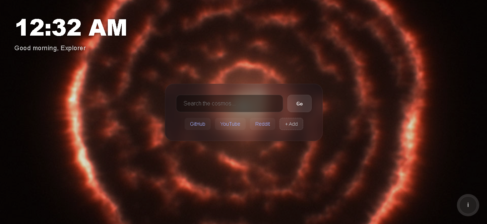
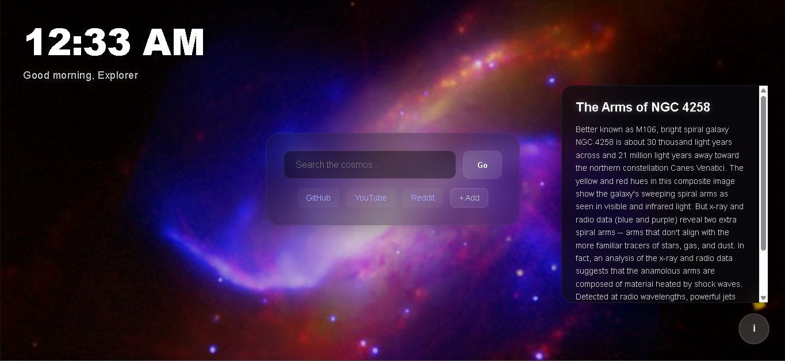
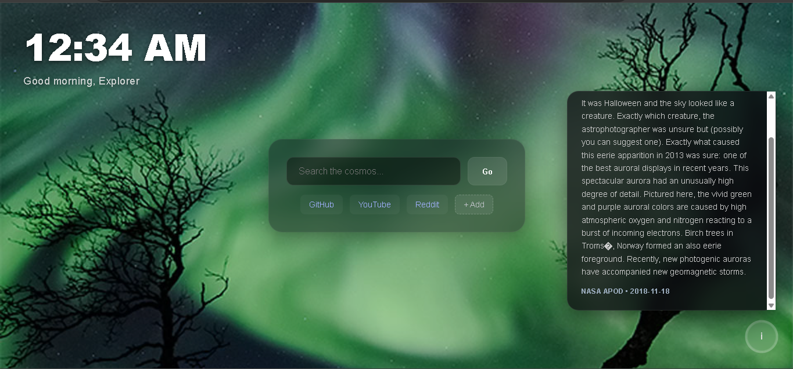

# NASA Pro — Explorer Dashboard

A new-tab replacement that pulls NASA's Astronomy Picture of the Day as your background and layers a real web search on top of it. Built for the "Give Your Website a Pulse" challenge.

**[Live Demo →](#)**

---

## Quickstart

You need Node 20+ and API keys for [NASA APOD](https://api.nasa.gov/) and [SerpApi](https://serpapi.com/).

```bash
git clone https://github.com/DEEPML1818/my-APOD-site
cd my-APOD-site
cp .env.example .env   # then fill in your keys
npm install && npm run dev
```

`.env` needs two values:

```
VITE_NASA_API_KEY=your_nasa_key
VITE_SERPAPI_KEY=your_serpapi_key
```

---

## Screenshots

### Main Dashboard


### APOD Info Panel open




### Integrated Search


---

## Features

- **Instant background on every open** — the previous NASA image loads from `localStorage` right away; the new one fetches quietly in the background so there is never a blank flash
- **Live web search without leaving the tab** — results render inside the page, with tabs for All, Images, News, and Videos
- **Search result caching** — switching tabs does not re-fire the API; results are stored per query so it stays fast
- **Custom bookmarks** — add and remove your own quick-links; they persist in `localStorage` across sessions
- **APOD info panel** — click the bottom strip to slide up the title and description for whatever image is showing
- **Live clock with time-based greeting** — updates every second, no library needed

---

## How it works

The trickiest part was making the background feel instant. Opening a new tab triggers a fetch, but fetches take time — so showing nothing until it resolves is a bad experience. The fix: on every load, the app checks `localStorage` for a cached image and paints the background with it immediately. Then it fires the NASA API call in the background and, if a new image comes back, swaps it in silently. The cache also holds a curated fallback list so the background never breaks even if the API is down or rate-limited.

The SerpApi integration had a CORS problem — browsers block direct calls to the SerpApi endpoint from a frontend page. I solved it with a Vite dev proxy in `vite.config.js` that rewrites `/api/search` to the SerpApi URL at the server level. In production the same rewrite goes through the host config.

The codebase started as one 650-line `main.js`. By day 5 it was split into `apod.js`, `clock.js`, and `bookmarks.js` — not because it was required, but because hunting for a clock bug inside a search result renderer is not fun.

---

## Tech

- Vanilla JS, HTML, CSS — no UI frameworks
- Vite (bundler + dev proxy)
- NASA APOD API
- SerpApi

---

## Credits

- [NASA APOD API](https://api.nasa.gov/) for the images
- [SerpApi](https://serpapi.com/) for search results
- Build diary is in [`DEVLOGS.md`](./DEVLOGS.md)
